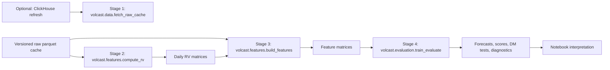

# Project Overview

## File Tree

```text
vol-forecast-benchmarks/
├── README.md
├── GUIDE_OVERVIEW.md
├── GUIDE_ROOT.md
├── config.toml
├── src/
│   ├── GUIDE_src.md
│   └── volcast/
│       ├── GUIDE_volcast.md
│       ├── shared/
│       │   ├── config.py
│       │   └── paths.py
│       ├── data/
│       │   ├── GUIDE_data.md
│       │   ├── cache_validation.py
│       │   └── fetch_raw_cache.py
│       ├── features/
│       │   ├── GUIDE_features.md
│       │   ├── rv_estimators.py
│       │   ├── compute_rv.py
│       │   ├── option_features.py
│       │   └── build_features.py
│       ├── evaluation/
│       │   ├── GUIDE_evaluation.md
│       │   ├── metrics.py
│       │   └── train_evaluate.py
│       ├── models/
│       │   ├── GUIDE_models.md
│       │   ├── base.py
│       │   ├── har.py
│       │   ├── garch.py
│       │   ├── linear.py
│       │   └── xgboost_model.py
│       └── pipeline/
│           ├── GUIDE_pipeline.md
│           └── run_pipeline.py
├── tests/
│   ├── GUIDE_tests.md
│   ├── test_fetch_data_cache.py
│   ├── test_rv_estimators.py
│   ├── test_option_features.py
│   ├── test_models.py
│   ├── test_evaluation.py
│   ├── test_no_lookahead.py
│   └── test_train_evaluate.py
├── data/
│   ├── GUIDE_data.md
│   ├── raw/
│   └── processed/
├── notebooks/
│   ├── GUIDE_notebooks.md
│   └── offline_pipeline_demo.ipynb
├── docs/
│   └── reference/
└── outputs/
```

## Purpose

This repository is a benchmark, not a product. It answers a focused research
question:

Given minute bars, option chains, and VIX context, how much predictive signal is
available for next-day and next-week realised variance under an honest
walk-forward evaluation protocol?

The system is tuned for interview clarity:

- quantitative assumptions are explicit,
- data timing is leakage-aware,
- default execution is reproducible offline,
- outputs include diagnostics beyond leaderboard rank.

## System Flow



## Quantitative Design

### Target Definition

The forecast target is realised variance, not volatility level. For the 1-day
horizon, target is $\sigma^2_{t+1}$. For the 5-day horizon, target is the mean of
the next five realised-variance observations.

### Feature Families

The model matrix combines:

- realised-variance lag structure (HAR-style),
- option-implied state variables (ATM IV, skew, term slope, IV-RV spread),
- lagged VIX market context.

### Evaluation Discipline

The benchmark uses expanding-window walk-forward training with periodic
retraining. Feature timing is explicitly lagged so date-$t$ predictors do not use
information from date $t$ close or later.

### Diagnostics

In addition to QLIKE and MSE, stage 4 writes model diagnostics that track
floor-hit rates, forecast ranges, and tail QLIKE behavior. This guards against
models that appear good on average while failing in volatility stress regimes.

## Offline-First Contract

The default clone-and-run path uses packaged raw parquet files in `data/raw`.
Stage 1 is optional and only needed when refreshing cache with ClickHouse
access. The notebook and stage-2-to-4 pipeline do not require database access.

## Scope And Limitations

- Default portable run uses single-asset SPY plus VIX context.
- Robustness symbols are documented as an extension path, not required default.
- Model family is intentionally compact to keep benchmark interpretation clear.
- Project optimizes for reproducible research quality over deployment features.
