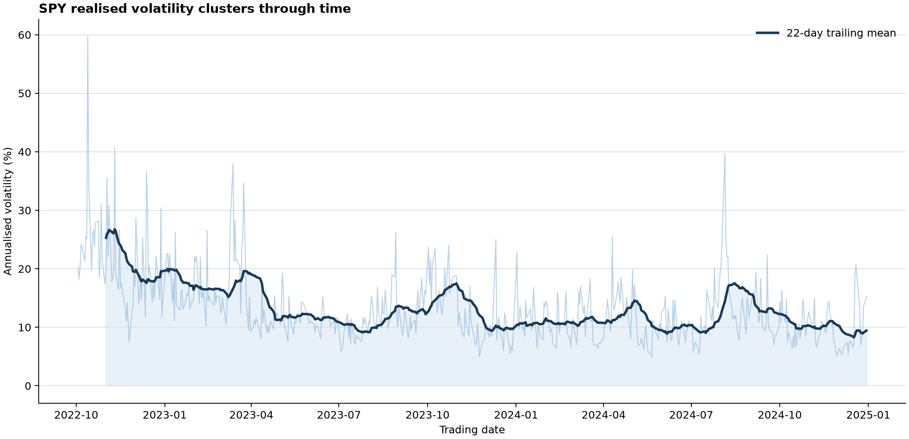
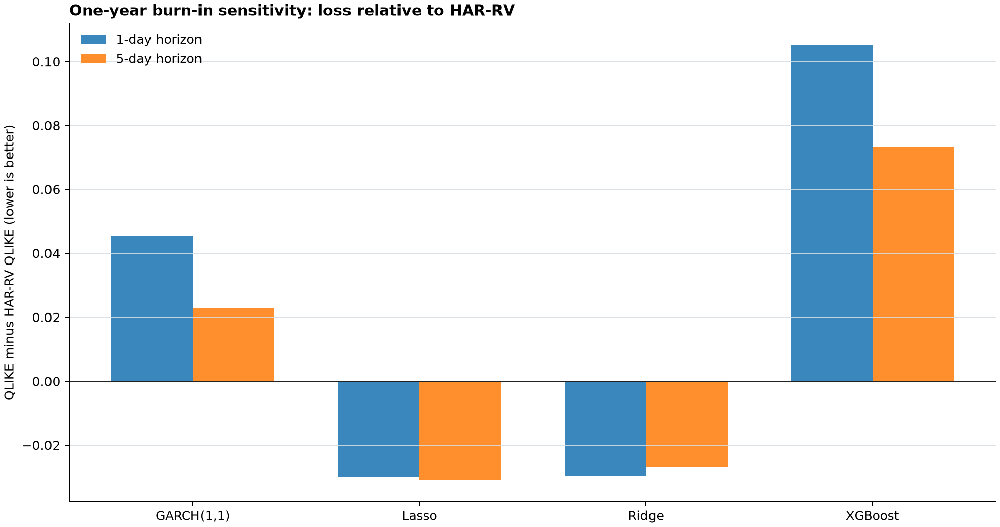
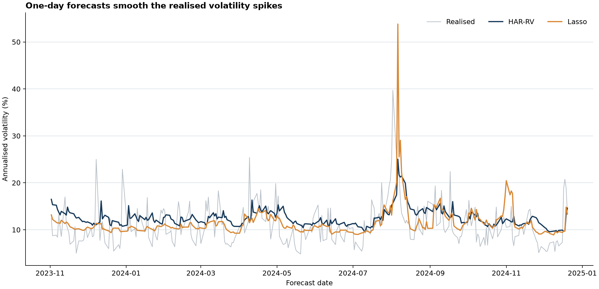

The first version of this benchmark exited successfully and produced no forecasts. Its feature matrix ended in December 2024, while the configuration reserved five calendar years for initial training from November 2022. The first possible test date would have fallen in November 2027.

The empty score table was mathematically consistent and useless. A pipeline that writes files, logs "complete," and exits with code zero looks healthy even when it never tests the research question.

I changed the contract in two places. The portable default now uses one calendar year of initial training. That fits the checked-in data and leaves 286 out-of-sample dates. A longer window is still allowed, but stage 4 raises a dated `InsufficientTrainingHistoryError` when the data cannot support it. The benchmark now fails before ranking models when the experiment is impossible.

## The object being forecast

The data contain minute bars for SPY, the ticker for the SPDR S&P 500 exchange-traded fund, along with option chains and the Cboe Volatility Index (VIX). The forecast target is realised variance, not option-implied volatility and not a trading return.

Let $P_{t,i}$ be the closing price of minute $i$ on trading day $t$. The intraday log return is

$$
r_{t,i}=\log\left(\frac{P_{t,i}}{P_{t,i-1}}\right).
$$

If day $t$ contains $M_t$ intraday returns, close-to-close realised variance is the sum of squared returns:

$$
RV_t=\sum_{i=1}^{M_t}r_{t,i}^2.
$$

Here, $RV_t$ is measured in squared decimal-return units. The pipeline requires at least 300 minute bars per day. It also calculates the Parkinson range estimator and the Garman-Klass open-high-low-close estimator, but $RV_t$ supplies the target and the core Heterogeneous Autoregressive Realised Variance (HAR-RV) features. This construction follows the realised-volatility literature developed by [Andersen, Bollerslev, Diebold, and Labys](https://doi.org/10.1111/1468-0262.00418).

For a feature row dated $t$, the one-day target is

$$
y_{t,1}=RV_{t+1}.
$$

The five-day target is the arithmetic mean of the next five daily variances:

$$
y_{t,5}=\frac{1}{5}\sum_{j=1}^{5}RV_{t+j}.
$$

The graph converts variance to annualised volatility as $100\sqrt{252RV_t}$, where 252 is the assumed number of trading days per year. This square-root conversion is for visual interpretation only. The models and losses remain in variance units.



The pale daily series jumps sharply, while its 22-day mean moves in persistent blocks. This is volatility clustering. It is also why a random train-test split would be a poor experiment: observations from the same episode would land on both sides of the split.

## What is known at each forecast date?

Feature timing determines whether the exercise is a forecast or a reconstruction. On row $t$, the realised-variance regressors contain observations through $t-1$. The daily HAR input is $RV_{t-1}$, while the weekly and monthly inputs average the previous 5 and 22 trading days.

The implementation shifts before rolling:

```python
shifted_series = lagged_df[column].shift(1)
rolling_mean = shifted_series.rolling(window=lag_window, min_periods=lag_window).mean()
lagged_df[lag_column_name] = rolling_mean
```

Option-chain features and VIX are also shifted forward by one business day before they are joined to row $t$. The option variables are at-the-money implied volatility (ATM IV), 25-delta put-call skew, term-structure slope, and the spread between implied and annualised realised volatility. Short gaps may be forward-filled for no more than three days.

The GARCH model is the exception to the $t-1$ feature convention. It uses the daily return observed on date $t$ to forecast variance from $t+1$ onward. That is valid for an end-of-day forecast, but it means the benchmark mixes two information sets: lagged market and option state for the regression models, and the current close-to-close return for GARCH. This conservative mismatch does not create lookahead, though it complicates a perfectly like-for-like interpretation.

After all required features and targets are present, the pipeline has 537 rows from 2022-11-02 through 2024-12-20. The first 251 rows form the initial calendar-year training sample. Evaluation begins on 2023-11-02.

## Five ways to forecast variance

### HAR-RV persistence at three scales

The HAR-RV model introduced by [Corsi](https://doi.org/10.1093/jjfinec/nbp001) compresses persistence into daily, weekly, and monthly averages. Define

$$
x_{d,t}=RV_{t-1},
$$

$$
x_{w,t}=\frac{1}{5}\sum_{j=1}^{5}RV_{t-j},
$$

and

$$
x_{m,t}=\frac{1}{22}\sum_{j=1}^{22}RV_{t-j}.
$$

For horizon $h$, measured in trading days, ordinary least squares estimates

$$
\widehat y_{t,h}
=\beta_0+\beta_d x_{d,t}+\beta_w x_{w,t}+\beta_m x_{m,t},
$$

where $\widehat y_{t,h}$ is forecast variance and $\beta_0$, $\beta_d$, $\beta_w$, and $\beta_m$ are fitted coefficients. Negative predictions are clipped to a small positive floor because QLIKE requires positive forecasts.

### GARCH(1,1) conditional variance from returns

Generalized Autoregressive Conditional Heteroskedasticity with one shock lag and one variance lag, abbreviated GARCH(1,1), follows [Bollerslev](https://doi.org/10.1016/0304-4076(86)90063-1). The zero-mean return model is

$$
r_t=\sigma_t\varepsilon_t,
$$

where $r_t$ is the daily return, $\sigma_t>0$ is conditional standard deviation, and the shock $\varepsilon_t$ has zero mean and unit variance. Conditional variance evolves as

$$
\sigma_{t+1}^2
=\omega+\alpha r_t^2+\beta\sigma_t^2,
$$

where $\omega>0$ is the variance intercept, $\alpha\geq0$ is the shock response, and $\beta\geq0$ is variance persistence. For horizons beyond one day, expected future shocks satisfy $E_t[r_{t+k}^2]=E_t[\sigma_{t+k}^2]$. The code therefore recurses with persistence $\alpha+\beta$ and averages the next $h$ conditional variances to match $y_{t,h}$:

```python
one_step_variance = (
    omega_decimal + self._alpha * observed_return**2 + self._beta * previous_variance
)

horizon_variance = one_step_variance
variance_sum = one_step_variance
for _ in range(1, self._forecast_horizon):
    horizon_variance = omega_decimal + persistence * horizon_variance
    variance_sum += horizon_variance
```

This horizon-aware recursion matters. Reusing a one-day conditional variance for the five-day average target answers a different question.

### Ridge and Lasso in log-variance space

Let $\mathbf{x}_t\in\mathbb{R}^{14}$ be the standardised feature vector and let $z_{t,h}=\log(y_{t,h})$ be the log-variance target. Ridge estimates coefficient vector $\boldsymbol\theta$ by solving

$$
\widehat{\boldsymbol\theta}_{\mathrm{ridge}}
=\arg\min_{\boldsymbol\theta}
\left\{
\sum_{t=1}^{T}\left(z_{t,h}-\theta_0-\mathbf{x}_t^\top\boldsymbol\theta\right)^2
+\lambda\lVert\boldsymbol\theta\rVert_2^2
\right\},
$$

where $T$ is the number of training rows, $\lambda\geq0$ controls shrinkage, and $\lVert\boldsymbol\theta\rVert_2^2$ is the sum of squared coefficients. Lasso, following [Tibshirani](https://doi.org/10.1111/j.2517-6161.1996.tb02080.x), replaces the squared penalty with the sum of absolute coefficients:

$$
\widehat{\boldsymbol\theta}_{\mathrm{lasso}}
=\arg\min_{\boldsymbol\theta}
\left\{
\sum_{t=1}^{T}\left(z_{t,h}-\theta_0-\mathbf{x}_t^\top\boldsymbol\theta\right)^2
+\lambda\lVert\boldsymbol\theta\rVert_1
\right\}.
$$

The penalty parameter $\lambda$ is selected with time-series cross-validation. Exponentiation maps the prediction back to positive variance:

```python
positive_predictions = np.exp(log_predictions)
return np.maximum(positive_predictions, MIN_POSITIVE_VARIANCE)
```

Log-space fitting changes the regression target and therefore the error geometry. It is not merely a numerical trick.

### XGBoost and nonlinear interactions

XGBoost fits an additive ensemble of regression trees, following [Chen and Guestrin](https://doi.org/10.1145/2939672.2939785). With tree functions $f_m$ and learning rate $\eta$, its prediction after $M$ trees has the form

$$
F_M(\mathbf{x}_t)=\sum_{m=1}^{M}\eta f_m(\mathbf{x}_t).
$$

The project uses 200 trees of maximum depth 4, row and column subsampling of 0.8, and a fixed random seed. Unlike HAR-RV or GARCH, the trees do not impose a volatility equation. They search for nonlinear thresholds and interactions in the same 14-feature matrix.

## A walk-forward protocol that can fail honestly

The corrected portable setting reserves one calendar year for initial training. Each fitted model then forecasts the next 21 trading-day block. At the next boundary, the training set expands to include all rows observed so far and the model is refitted. Forecast dates never enter the fit that precedes them.

| Default-run audit | Value |
|---|---:|
| Realised-variance rows | 564 |
| Complete feature rows | 537 |
| Feature range | 2022-11-02 to 2024-12-20 |
| Initial training period | 1 calendar year |
| First forecast date | 2023-11-02 |
| Last forecast date | 2024-12-20 |
| Forecast origins per model and horizon | 286 |

One year is not claimed to be an optimal estimation window. It is a portable-sample choice fixed before comparing scores. A five-year research window requires more historical data.

The earlier code returned an empty frame when a requested window was impossible. The evaluator now stops instead:

```python
raise InsufficientTrainingHistoryError(
    f"{symbol} horizon={horizon}: initial training window is infeasible. "
    f"The {len(working_df)} feature rows span {first_date.date()} to "
    f"{last_date.date()}, while initial_train_years={initial_train_years} "
    f"requires a first evaluation date on or after {required_cutoff.date()}"
)
```

Failing here protects the meaning of every downstream table. An empty file can be a valid software artifact, but it is not empirical evidence.

## Two losses, two ideas of a good forecast

Let $n$ be the number of out-of-sample observations, $y_t>0$ realised variance, and $\widehat y_t>0$ forecast variance. Mean squared error (MSE) is

$$
\operatorname{MSE}
=\frac{1}{n}\sum_{t=1}^{n}\left(y_t-\widehat y_t\right)^2.
$$

MSE is measured in squared-variance units and places large weight on large absolute misses. The project's quasi-likelihood loss (QLIKE) is

$$
\operatorname{QLIKE}
=\frac{1}{n}\sum_{t=1}^{n}
\left[
\log(\widehat y_t)+\frac{y_t}{\widehat y_t}
\right].
$$

QLIKE focuses on the ratio of realised to forecast variance and belongs to the class of loss functions studied by [Patton](https://doi.org/10.1016/j.jeconom.2010.03.034) for noisy volatility proxies. Lower is better for both metrics. QLIKE values are negative here because variance is recorded in small decimal units. Changing variance units shifts absolute QLIKE levels, so comparisons within the same target and units carry the information.

## Corrected default results

The unchanged portable command now produces the following scores:

| Horizon | Model | QLIKE | QLIKE vs. HAR-RV | MSE | Observations |
|---:|---|---:|---:|---:|---:|
| 1 day | Lasso | -8.8272 | -0.0301 | 5.9584e-09 | 286 |
| 1 day | Ridge | -8.8268 | -0.0296 | 6.2964e-09 | 286 |
| 1 day | HAR-RV | -8.7972 | 0.0000 | 2.8105e-09 | 286 |
| 1 day | GARCH(1,1) | -8.7618 | 0.0353 | 3.1336e-09 | 286 |
| 1 day | XGBoost | -8.6919 | 0.1052 | 3.9683e-09 | 286 |
| 5 days | Lasso | -8.8008 | -0.0309 | 2.3718e-09 | 286 |
| 5 days | Ridge | -8.7967 | -0.0268 | 2.2992e-09 | 286 |
| 5 days | HAR-RV | -8.7699 | 0.0000 | 1.6964e-09 | 286 |
| 5 days | GARCH(1,1) | -8.7472 | 0.0226 | 1.7717e-09 | 286 |
| 5 days | XGBoost | -8.6966 | 0.0733 | 2.4243e-09 | 286 |



Lasso has the lowest QLIKE at both horizons, with Ridge close behind. HAR-RV has the lowest MSE at both horizons. At one day, Lasso's MSE is more than twice HAR-RV's even though Lasso wins QLIKE. There is no "best model" until the loss function is named.



Both forecast paths smooth the sharpest realised-volatility moves. Lasso can produce larger isolated forecasts, which hurts its squared error when the move does not materialise. Its lower QLIKE says the variance ratio is better on average, not that every pathwise miss is smaller.

None of the 2,860 forecasts hit the positive variance floor. That diagnostic matters because repeated clipping can make a model look stable while hiding invalid negative raw predictions.

## What the pairwise tests add

For models $a$ and $b$, let $L_{a,t}$ and $L_{b,t}$ be their QLIKE losses on date $t$. The Diebold-Mariano loss differential is

$$
d_t=L_{a,t}-L_{b,t}.
$$

The null hypothesis is $E[d_t]=0$. A positive test statistic means model $a$ has higher average loss. The test follows [Diebold and Mariano](https://doi.org/10.1080/07350015.1995.10524599), with a Newey-West-style long-run variance estimate in this implementation.

For HAR-RV against Lasso, the statistic is 2.0812 with a two-sided $p$-value of 0.0374 at one day. At five days, it is 2.1698 with a $p$-value of 0.0300. Those two comparisons reject equal QLIKE accuracy at the 5% level under the implementation's large-sample approximation.

The evidence is narrower than those decimals suggest. The five-day targets overlap. There are ten pairwise tests per horizon without a multiple-testing adjustment. The sample contains one asset and roughly fourteen months of out-of-sample forecasts. These are benchmark diagnostics, not a universal ranking of volatility models.

## What remains unresolved

The repaired default answers the question it claims to answer, but four limitations remain.

First, a one-year burn-in is short for a model expected to span several volatility regimes. Extending the raw history is preferable to tuning the window on these results. Second, SPY and VIX do not establish cross-asset generality. Third, the option features are lagged safely, but stale quotes, sparse expiries, and three-day forward-fills may still alter their economic meaning. Fourth, the information set is not identical across model families because GARCH uses the current daily return while the other market-state variables are lagged.

The result I would carry forward is methodological. A forecast benchmark has to align the target horizon, feature-availability time, and training cutoff. Once those times are explicit, the score disagreement has a clear meaning. Lasso is better under QLIKE. HAR-RV is better under MSE. Neither result extends beyond this sample without more data.

## Primary references

- Andersen, T. G., Bollerslev, T., Diebold, F. X., and Labys, P. (2003). [Modeling and Forecasting Realized Volatility](https://doi.org/10.1111/1468-0262.00418).
- Bollerslev, T. (1986). [Generalized Autoregressive Conditional Heteroskedasticity](https://doi.org/10.1016/0304-4076(86)90063-1).
- Chen, T., and Guestrin, C. (2016). [XGBoost: A Scalable Tree Boosting System](https://doi.org/10.1145/2939672.2939785).
- Corsi, F. (2009). [A Simple Approximate Long-Memory Model of Realized Volatility](https://doi.org/10.1093/jjfinec/nbp001).
- Diebold, F. X., and Mariano, R. S. (1995). [Comparing Predictive Accuracy](https://doi.org/10.1080/07350015.1995.10524599).
- Patton, A. J. (2011). [Volatility Forecast Comparison Using Imperfect Volatility Proxies](https://doi.org/10.1016/j.jeconom.2010.03.034).
- Tibshirani, R. (1996). [Regression Shrinkage and Selection via the Lasso](https://doi.org/10.1111/j.2517-6161.1996.tb02080.x).
